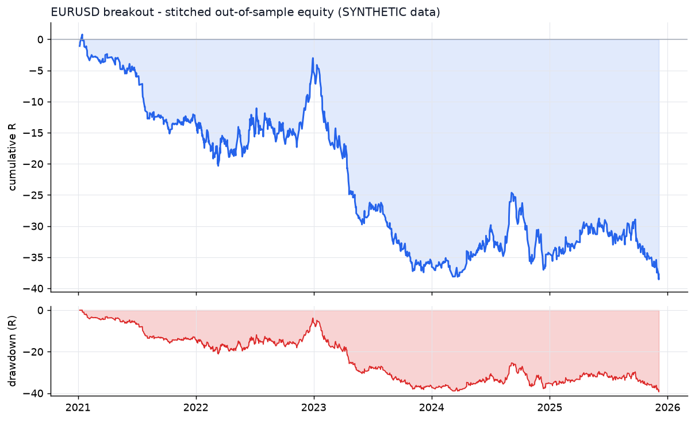
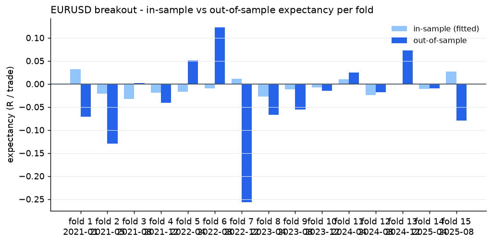
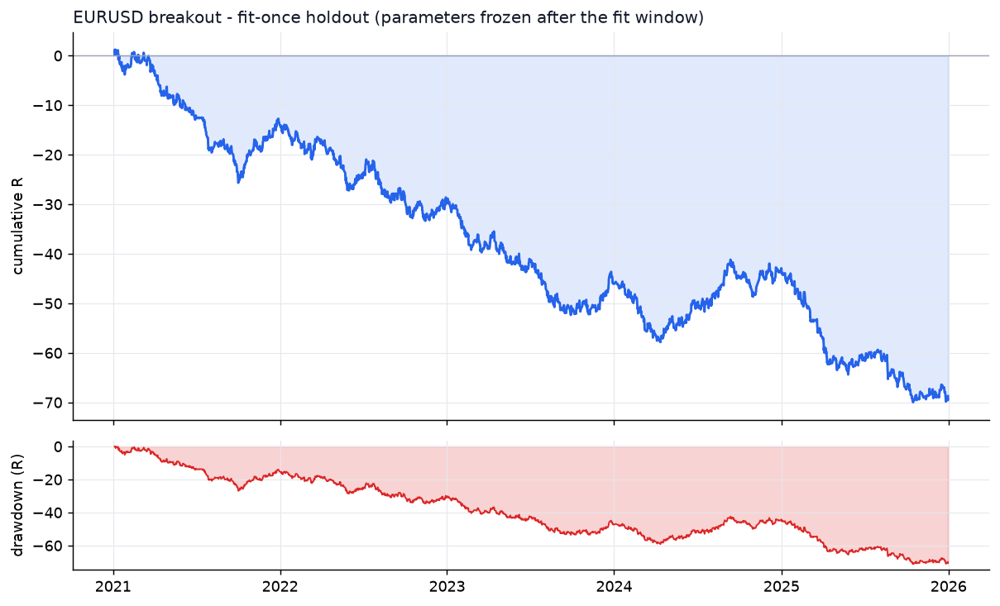

# EURUSD - breakout - walk-forward result

- data: **SYNTHETIC (engine validation only)** - cache/EURUSD_synth_7_2019-01-02_2025-12-31.parquet
- span: 2019-01-02 to 2025-12-31
- folds: 15 x (train 730d / test 120d), contiguous out-of-sample coverage 1800 days
- configurations evaluated: 6,000

## Targets, measured on out-of-sample data only

| Target | Required | Achieved | Result |
|---|---|---|---|
| Trades >= 100 | 100 | 1181 | **PASS** |
| Profit factor >= 1.20 | 1.20 | 0.88 | FAIL |
| Win rate >= 50% | 50.0 | 47.2 | FAIL |

## Metrics

| Metric | Walk-forward OOS | Fit-once holdout | Full sample (deployed params) |
|---|---|---|---|
| Trades | 1181 | 2294 | 1633 |
| Win rate % | 47.2 | 48.2 | 53.2 |
| Profit factor | 0.88 | 0.86 | 0.92 |
| Expectancy (R) | -0.032 | -0.030 | -0.027 |
| Avg win (R) | 0.48 | 0.37 | 0.63 |
| Avg loss (R) | -0.49 | -0.40 | -0.77 |
| Payoff | 0.98 | 0.92 | 0.81 |
| Total R | -37.8 | -68.7 | -44.8 |
| Return % | -18.3 | -28.8 | -20.7 |
| Max DD % | 18.3 | 29.9 | 27.1 |
| Max DD (R) | 39.4 | 71.2 | 61.6 |
| Sharpe | -0.94 | -1.25 | -0.48 |
| Sortino | -1.55 | -1.76 | -0.65 |
| CAGR % | -5.6 | -5.3 | -2.6 |
| Calmar | -0.31 | -0.18 | -0.10 |
| Trades/day | 1.39 | 1.47 | 0.75 |
| Avg hold (min) | 118 | 177 | 137 |
| Max consec. losses | 8 | 10 | 9 |
| t-stat of mean R | -1.76 | -3.01 | -1.41 |
| Friction / gross % | 13.6 | 11.5 | 11.6 |

- walk-forward efficiency (OOS / IS expectancy): **0.00**
- bootstrap p-value for mean R > 0 (OOS): **0.9592**
- neighbourhood stability: 21 neighbours, median score 0.13, 62% positive

## Per-fold

```
walk-forward folds:
  1: train 2019-01-02..2021-01-01 IS  401tr +0.032R -> test 2021-01-01..2021-05-01 OOS   45tr -0.072R PF 0.67 WR 46.7%
  2: train 2019-05-02..2021-05-01 IS  472tr -0.022R -> test 2021-05-01..2021-08-29 OOS   71tr -0.130R PF 0.48 WR 43.7%
  3: train 2019-08-30..2021-08-29 IS  609tr -0.033R -> test 2021-08-29..2021-12-27 OOS  119tr +0.002R PF 1.02 WR 44.5%
  4: train 2019-12-28..2021-12-27 IS  917tr -0.019R -> test 2021-12-27..2022-04-26 OOS  152tr -0.041R PF 0.80 WR 46.1%
  5: train 2020-04-26..2022-04-26 IS  435tr -0.017R -> test 2022-04-26..2022-08-24 OOS   83tr +0.051R PF 1.14 WR 55.4%
  6: train 2020-08-24..2022-08-24 IS  419tr -0.010R -> test 2022-08-24..2022-12-22 OOS   57tr +0.123R PF 1.40 WR 57.9%
  7: train 2020-12-22..2022-12-22 IS  447tr +0.011R -> test 2022-12-22..2023-04-21 OOS   69tr -0.256R PF 0.54 WR 34.8%
  8: train 2021-04-21..2023-04-21 IS  441tr -0.027R -> test 2023-04-21..2023-08-19 OOS   78tr -0.067R PF 0.71 WR 44.9%
  9: train 2021-08-19..2023-08-19 IS  591tr -0.011R -> test 2023-08-19..2023-12-17 OOS  108tr -0.055R PF 0.69 WR 43.5%
  10: train 2021-12-17..2023-12-17 IS  428tr -0.008R -> test 2023-12-17..2024-04-15 OOS   56tr -0.015R PF 0.91 WR 44.6%
  11: train 2022-04-16..2024-04-15 IS  412tr +0.010R -> test 2024-04-15..2024-08-13 OOS   82tr +0.025R PF 1.11 WR 48.8%
  12: train 2022-08-14..2024-08-13 IS  477tr -0.024R -> test 2024-08-13..2024-12-11 OOS   63tr -0.018R PF 0.96 WR 52.4%
  13: train 2022-12-12..2024-12-11 IS  415tr -0.001R -> test 2024-12-11..2025-04-10 OOS   64tr +0.072R PF 1.37 WR 53.1%
  14: train 2023-04-11..2025-04-10 IS  451tr -0.011R -> test 2025-04-10..2025-08-08 OOS   61tr -0.010R PF 0.97 WR 50.8%
  15: train 2023-08-09..2025-08-08 IS  443tr +0.027R -> test 2025-08-08..2025-12-06 OOS   73tr -0.080R PF 0.76 WR 47.9%
stitched OOS: trades  1181 | WR  47.2% | PF  0.88 | exp -0.032R | payoff 0.98 | totR   -37.8 | ret   -18.3% | DD  18.3% | Sharpe -0.94 | t -1.76
walk-forward efficiency: 0.00
```

## Deployed parameters

```json
{
  "strategy": {
    "mode": "breakout",
    "tf_minutes": 5,
    "session": "ny",
    "atr_period": 14,
    "atr_rank_lookback": 288,
    "atr_rank_min": 0.1,
    "atr_rank_max": 0.99,
    "sl_atr": 2.0,
    "tp_r": 1.5,
    "min_sl_points": 160,
    "allow_long": true,
    "allow_short": true,
    "er_period": 24,
    "er_min": 0.3,
    "er_max": 1.0,
    "vwap_anchor_hour": 0,
    "band_k": 2.0,
    "rsi_period": 7,
    "rsi_lo": 28.0,
    "rsi_hi": 72.0,
    "adx_period": 14,
    "adx_max": 30.0,
    "confirm_mode": 2,
    "min_dev_atr": 0.0,
    "don_period": 24,
    "ema_fast": 12,
    "ema_slow": 48,
    "adx_min": 12,
    "expansion_mult": 1.0,
    "atr_avg_period": 48,
    "pb_slope_period": 30,
    "pb_rsi_lo": 40.0,
    "pb_rsi_hi": 60.0,
    "pb_depth_atr": 0.5,
    "pb_lookback": 6,
    "mom_period": 24,
    "mom_min_atr": 1.0,
    "mom_confirm": 1
  },
  "execution": {
    "point": 1e-05,
    "value_per_point_per_lot": 1.0,
    "min_lot": 0.01,
    "lot_step": 0.01,
    "max_lot": 50.0,
    "commission_per_lot_rt": 7.0,
    "slippage_points_entry": 1.5,
    "slippage_points_stop": 3.0,
    "swap_long_points": -8.0,
    "swap_short_points": 2.0,
    "initial_equity": 10000.0,
    "risk_pct": 0.005,
    "max_spread_points": 30.0,
    "be_trigger_r": 1.0,
    "be_offset_r": 0.1,
    "partial_r": 0.8,
    "partial_frac": 0.5,
    "trail_start_r": 0.0,
    "trail_dist_r": 1.0,
    "max_bars": 180,
    "cooldown_bars": 5,
    "max_trades_per_day": 8,
    "daily_loss_limit_r": 1000000000.0,
    "force_exit_hour": 20,
    "force_exit_min": 45,
    "compound": true
  }
}
```

## Out-of-sample breakdown

**by hour**

|   hour |   trades |   win_rate |   total_r |   exp_r |
|-------:|---------:|-----------:|----------:|--------:|
|      6 |       35 |       40   |       0.6 |   0.017 |
|      7 |      118 |       46.6 |      -2.5 |  -0.022 |
|      8 |       98 |       52   |       1   |   0.01  |
|      9 |       54 |       35.2 |      -7.3 |  -0.135 |
|     10 |       61 |       44.3 |      -3.5 |  -0.057 |
|     11 |       26 |       38.5 |      -2.8 |  -0.108 |
|     12 |       94 |       52.1 |       5.3 |   0.056 |
|     13 |      239 |       50.2 |       1.7 |   0.007 |
|     14 |      177 |       49.7 |     -14.6 |  -0.083 |
|     15 |      161 |       46   |      -7   |  -0.043 |
|     16 |       80 |       46.2 |      -4.9 |  -0.062 |
|     17 |       33 |       36.4 |      -3.1 |  -0.095 |
|     18 |        5 |       40   |      -0.6 |  -0.119 |

**by direction**

| direction   |   trades |   win_rate |   total_r |   exp_r |
|:------------|---------:|-----------:|----------:|--------:|
| long        |      598 |       47.8 |      -8.3 |  -0.014 |
| short       |      583 |       46.7 |     -29.5 |  -0.051 |

**by exit**

| exit_reason   |   trades |   win_rate |   total_r |   exp_r |
|:--------------|---------:|-----------:|----------:|--------:|
| breakeven     |       11 |      100   |       5   |   0.457 |
| session_close |        1 |        0   |      -0   |  -0.023 |
| stop_loss     |      154 |        9.7 |    -142.5 |  -0.926 |
| take_profit   |       42 |      100   |      56.9 |   1.355 |
| time_stop     |      973 |       50.4 |      42.9 |   0.044 |

**by year**

|   year |   trades |   win_rate |   total_r |   exp_r |
|-------:|---------:|-----------:|----------:|--------:|
|   2021 |      240 |       44.2 |     -13.3 |  -0.055 |
|   2022 |      294 |       52   |       8.2 |   0.028 |
|   2023 |      256 |       41   |     -30.4 |  -0.119 |
|   2024 |      205 |       49.3 |       1.1 |   0.005 |
|   2025 |      186 |       50   |      -3.3 |  -0.018 |







