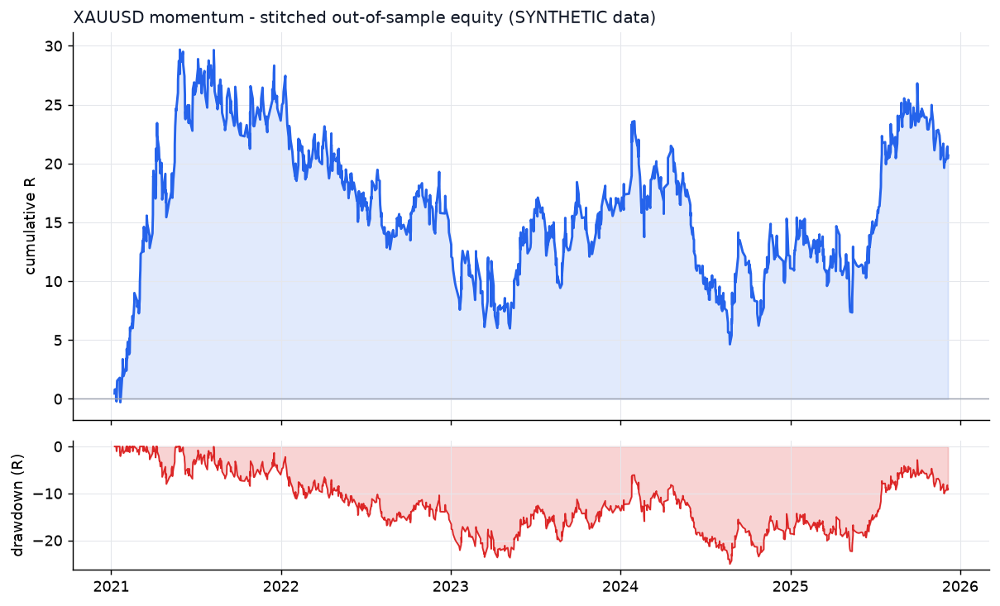
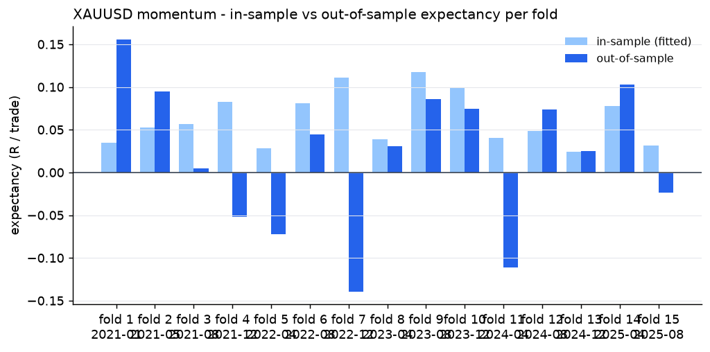
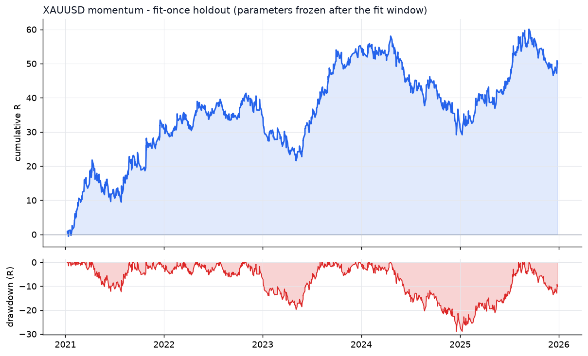

# XAUUSD - momentum - walk-forward result

- data: **SYNTHETIC (engine validation only)** - cache/XAUUSD_synth_7_2019-01-02_2025-12-31.parquet
- span: 2019-01-02 to 2025-12-31
- folds: 15 x (train 730d / test 120d), contiguous out-of-sample coverage 1800 days
- configurations evaluated: 6,000

## Targets, measured on out-of-sample data only

| Target | Required | Achieved | Result |
|---|---|---|---|
| Trades >= 100 | 100 | 1256 | **PASS** |
| Profit factor >= 1.20 | 1.20 | 1.05 | FAIL |
| Win rate >= 50% | 50.0 | 49.6 | FAIL |

## Metrics

| Metric | Walk-forward OOS | Fit-once holdout | Full sample (deployed params) |
|---|---|---|---|
| Trades | 1256 | 1195 | 1891 |
| Win rate % | 49.6 | 50.8 | 50.3 |
| Profit factor | 1.05 | 1.10 | 1.06 |
| Expectancy (R) | 0.016 | 0.042 | 0.020 |
| Avg win (R) | 0.75 | 0.89 | 0.72 |
| Avg loss (R) | -0.71 | -0.83 | -0.69 |
| Payoff | 1.06 | 1.07 | 1.04 |
| Total R | 20.5 | 50.0 | 38.1 |
| Return % | 10.8 | 25.1 | 17.7 |
| Max DD % | 12.4 | 13.7 | 12.3 |
| Max DD (R) | 25.0 | 28.9 | 26.2 |
| Sharpe | 0.36 | 0.59 | 0.35 |
| Sortino | 0.86 | 1.11 | 0.58 |
| CAGR % | 3.0 | 3.7 | 1.9 |
| Calmar | 0.24 | 0.27 | 0.15 |
| Trades/day | 1.64 | 0.76 | 0.86 |
| Avg hold (min) | 114 | 123 | 95 |
| Max consec. losses | 11 | 13 | 12 |
| t-stat of mean R | 0.66 | 1.47 | 1.07 |
| Friction / gross % | 8.0 | 8.2 | 7.0 |

- walk-forward efficiency (OOS / IS expectancy): **0.26**
- bootstrap p-value for mean R > 0 (OOS): **0.2542**
- neighbourhood stability: 19 neighbours, median score 0.28, 95% positive

## Per-fold

```
walk-forward folds:
  1: train 2019-01-02..2021-01-01 IS  531tr +0.034R -> test 2021-01-01..2021-05-01 OOS   99tr +0.156R PF 1.44 WR 56.6%
  2: train 2019-05-02..2021-05-01 IS  583tr +0.053R -> test 2021-05-01..2021-08-29 OOS   94tr +0.094R PF 1.23 WR 55.3%
  3: train 2019-08-30..2021-08-29 IS  570tr +0.057R -> test 2021-08-29..2021-12-27 OOS   81tr +0.005R PF 1.01 WR 51.9%
  4: train 2019-12-28..2021-12-27 IS  648tr +0.083R -> test 2021-12-27..2022-04-26 OOS   81tr -0.052R PF 0.88 WR 46.9%
  5: train 2020-04-26..2022-04-26 IS  649tr +0.029R -> test 2022-04-26..2022-08-24 OOS  107tr -0.072R PF 0.76 WR 47.7%
  6: train 2020-08-24..2022-08-24 IS  448tr +0.081R -> test 2022-08-24..2022-12-22 OOS   78tr +0.045R PF 1.16 WR 50.0%
  7: train 2020-12-22..2022-12-22 IS  510tr +0.111R -> test 2022-12-22..2023-04-21 OOS   62tr -0.139R PF 0.75 WR 40.3%
  8: train 2021-04-21..2023-04-21 IS  513tr +0.039R -> test 2023-04-21..2023-08-19 OOS   94tr +0.031R PF 1.10 WR 54.3%
  9: train 2021-08-19..2023-08-19 IS  412tr +0.118R -> test 2023-08-19..2023-12-17 OOS   59tr +0.086R PF 1.20 WR 55.9%
  10: train 2021-12-17..2023-12-17 IS  426tr +0.100R -> test 2023-12-17..2024-04-15 OOS   66tr +0.075R PF 1.18 WR 53.0%
  11: train 2022-04-16..2024-04-15 IS  589tr +0.040R -> test 2024-04-15..2024-08-13 OOS  115tr -0.111R PF 0.59 WR 40.0%
  12: train 2022-08-14..2024-08-13 IS  438tr +0.048R -> test 2024-08-13..2024-12-11 OOS   61tr +0.074R PF 1.20 WR 50.8%
  13: train 2022-12-12..2024-12-11 IS  474tr +0.024R -> test 2024-12-11..2025-04-10 OOS   97tr +0.025R PF 1.08 WR 46.4%
  14: train 2023-04-11..2025-04-10 IS  429tr +0.078R -> test 2025-04-10..2025-08-08 OOS   77tr +0.103R PF 1.33 WR 48.1%
  15: train 2023-08-09..2025-08-08 IS  534tr +0.031R -> test 2025-08-08..2025-12-06 OOS   85tr -0.023R PF 0.93 WR 49.4%
stitched OOS: trades  1256 | WR  49.6% | PF  1.05 | exp +0.016R | payoff 1.06 | totR   +20.5 | ret   +10.8% | DD  12.4% | Sharpe  0.36 | t  0.66
walk-forward efficiency: 0.26
```

## Deployed parameters

```json
{
  "strategy": {
    "mode": "momentum",
    "tf_minutes": 15,
    "session": "ny",
    "atr_period": 14,
    "atr_rank_lookback": 288,
    "atr_rank_min": 0.1,
    "atr_rank_max": 0.99,
    "sl_atr": 2.0,
    "tp_r": 1.2,
    "min_sl_points": 750,
    "allow_long": true,
    "allow_short": true,
    "er_period": 24,
    "er_min": 0.3,
    "er_max": 1.0,
    "vwap_anchor_hour": 0,
    "band_k": 2.0,
    "rsi_period": 7,
    "rsi_lo": 28.0,
    "rsi_hi": 72.0,
    "adx_period": 14,
    "adx_max": 30.0,
    "confirm_mode": 2,
    "min_dev_atr": 0.0,
    "don_period": 24,
    "ema_fast": 12,
    "ema_slow": 48,
    "adx_min": 20.0,
    "expansion_mult": 1.15,
    "atr_avg_period": 48,
    "pb_slope_period": 30,
    "pb_rsi_lo": 40.0,
    "pb_rsi_hi": 60.0,
    "pb_depth_atr": 0.5,
    "pb_lookback": 6,
    "mom_period": 12,
    "mom_min_atr": 1.0,
    "mom_confirm": 1
  },
  "execution": {
    "point": 0.01,
    "value_per_point_per_lot": 1.0,
    "min_lot": 0.01,
    "lot_step": 0.01,
    "max_lot": 20.0,
    "commission_per_lot_rt": 7.0,
    "slippage_points_entry": 6.0,
    "slippage_points_stop": 14.0,
    "swap_long_points": -40.0,
    "swap_short_points": 10.0,
    "initial_equity": 10000.0,
    "risk_pct": 0.005,
    "max_spread_points": 90.0,
    "be_trigger_r": 0.0,
    "be_offset_r": 0.1,
    "partial_r": 0.0,
    "partial_frac": 0.5,
    "trail_start_r": 1.2,
    "trail_dist_r": 1.0,
    "max_bars": 120,
    "cooldown_bars": 20,
    "max_trades_per_day": 8,
    "daily_loss_limit_r": 1000000000.0,
    "force_exit_hour": 20,
    "force_exit_min": 45,
    "compound": true
  }
}
```

## Out-of-sample breakdown

**by hour**

|   hour |   trades |   win_rate |   total_r |   exp_r |
|-------:|---------:|-----------:|----------:|--------:|
|      6 |       15 |       60   |       1.9 |   0.125 |
|      7 |       94 |       42.6 |      -4.8 |  -0.051 |
|      8 |       69 |       55.1 |       6.4 |   0.093 |
|      9 |       70 |       38.6 |      -8.3 |  -0.119 |
|     10 |       69 |       43.5 |      -6.4 |  -0.092 |
|     11 |       51 |       51   |       1.7 |   0.034 |
|     12 |      165 |       48.5 |      -2.8 |  -0.017 |
|     13 |      138 |       50.7 |       1.7 |   0.012 |
|     14 |      148 |       55.4 |      20.6 |   0.14  |
|     15 |      159 |       55.3 |      14.2 |   0.09  |
|     16 |      107 |       55.1 |       7.4 |   0.069 |
|     17 |      114 |       42.1 |     -11.3 |  -0.099 |
|     18 |       44 |       50   |       1.4 |   0.032 |
|     19 |        8 |       37.5 |      -0.3 |  -0.043 |
|     20 |        5 |       20   |      -0.9 |  -0.185 |

**by direction**

| direction   |   trades |   win_rate |   total_r |   exp_r |
|:------------|---------:|-----------:|----------:|--------:|
| long        |      638 |       49.5 |      24.3 |   0.038 |
| short       |      618 |       49.7 |      -3.8 |  -0.006 |

**by exit**

| exit_reason   |   trades |   win_rate |   total_r |   exp_r |
|:--------------|---------:|-----------:|----------:|--------:|
| breakeven     |       26 |      100   |      13.2 |   0.509 |
| session_close |       24 |       41.7 |      -0.1 |  -0.002 |
| stop_loss     |      384 |       14.6 |    -318.4 |  -0.829 |
| take_profit   |      110 |      100   |     175.7 |   1.598 |
| time_stop     |      712 |       59.1 |     150.1 |   0.211 |

**by year**

|   year |   trades |   win_rate |   total_r |   exp_r |
|-------:|---------:|-----------:|----------:|--------:|
|   2021 |      275 |       54.5 |      23.6 |   0.086 |
|   2022 |      267 |       47.9 |      -9.5 |  -0.036 |
|   2023 |      217 |       51.6 |       2.9 |   0.013 |
|   2024 |      259 |       45.9 |      -5.9 |  -0.023 |
|   2025 |      238 |       47.9 |       9.4 |   0.04  |







