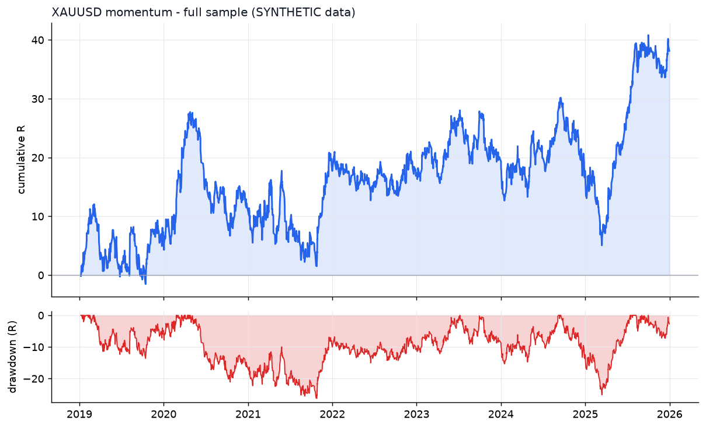

# XAUUSD - momentum - full-sample backtest

- data: **SYNTHETIC (engine validation only)** - cache/XAUUSD_synth_7_2019-01-02_2025-12-31.parquet
- span: 2019-01-02 to 2025-12-31

> Full-sample numbers include the windows the parameters were fitted on.
> The honest estimate is the walk-forward out-of-sample report.

| Target | Required | Achieved | Result |
|---|---|---|---|
| Trades >= 100 | 100 | 1891 | **PASS** |
| Profit factor >= 1.20 | 1.20 | 1.06 | FAIL |
| Win rate >= 50% | 50.0 | 50.3 | **PASS** |

| Metric | Full sample |
|---|---|
| Trades | 1891 |
| Win rate % | 50.3 |
| Profit factor | 1.06 |
| Expectancy (R) | 0.020 |
| Avg win (R) | 0.72 |
| Avg loss (R) | -0.69 |
| Payoff | 1.04 |
| Total R | 38.1 |
| Return % | 17.7 |
| Max DD % | 12.3 |
| Max DD (R) | 26.2 |
| Sharpe | 0.35 |
| Sortino | 0.58 |
| CAGR % | 1.9 |
| Calmar | 0.15 |
| Trades/day | 0.86 |
| Avg hold (min) | 95 |
| Max consec. losses | 12 |
| t-stat of mean R | 1.07 |
| Friction / gross % | 7.0 |

## Cost sensitivity

|   cost_multiple |   trades |   win_rate_% |   profit_factor |   expectancy_R |
|----------------:|---------:|-------------:|----------------:|---------------:|
|            1    |     1891 |         50.3 |           1.059 |         0.0202 |
|            1.25 |     1892 |         49.5 |           1.015 |         0.0054 |
|            1.5  |     1890 |         48.8 |           0.958 |        -0.0152 |
|            2    |     1880 |         47.6 |           0.886 |        -0.0426 |

## Monte Carlo

_Permutation answers 'how bad could the path have been'; bootstrap answers 'what else could this edge have produced'. Reordering cannot change the total, so only the bootstrap rows speak to the outcome._

- actual_total_R: 38.133
- perm_median_max_dd_R: 27.862
- perm_p95_max_dd_R: 43.208
- boot_p05_total_R: -22.069
- boot_median_total_R: 36.959
- boot_p95_total_R: 97.786
- boot_prob_total_negative: 0.145
- boot_p95_max_dd_R: 55.529

## Breakdown

**by hour**

|   hour |   trades |   win_rate |   total_r |   exp_r |
|-------:|---------:|-----------:|----------:|--------:|
|     12 |      408 |       49   |       8.1 |   0.02  |
|     13 |      309 |       49.5 |      -5   |  -0.016 |
|     14 |      311 |       52.4 |      16.8 |   0.054 |
|     15 |      294 |       48.3 |       0.7 |   0.002 |
|     16 |      249 |       49.8 |       0.8 |   0.003 |
|     17 |      252 |       53.6 |      15   |   0.059 |
|     18 |       68 |       51.5 |       1.8 |   0.027 |

**by direction**

| direction   |   trades |   win_rate |   total_r |   exp_r |
|:------------|---------:|-----------:|----------:|--------:|
| long        |      979 |       50.7 |      31.4 |   0.032 |
| short       |      912 |       50   |       6.7 |   0.007 |

**by exit**

| exit_reason   |   trades |   win_rate |   total_r |   exp_r |
|:--------------|---------:|-----------:|----------:|--------:|
| stop_loss     |      477 |        0   |    -490.2 |  -1.028 |
| take_profit   |      368 |      100   |     438.3 |   1.191 |
| time_stop     |     1046 |       55.8 |      90.1 |   0.086 |

**by year**

|   year |   trades |   win_rate |   total_r |   exp_r |
|-------:|---------:|-----------:|----------:|--------:|
|   2019 |      267 |       46.8 |       6.8 |   0.025 |
|   2020 |      272 |       51.1 |       4.4 |   0.016 |
|   2021 |      290 |       52.8 |       6.5 |   0.022 |
|   2022 |      264 |       51.1 |      -0.5 |  -0.002 |
|   2023 |      251 |       48.2 |       2.5 |   0.01  |
|   2024 |      272 |       48.2 |      -3.1 |  -0.011 |
|   2025 |      275 |       53.8 |      21.5 |   0.078 |


## Parameters

```json
{
  "strategy": {
    "mode": "momentum",
    "tf_minutes": 15,
    "session": "ny",
    "atr_period": 14,
    "atr_rank_lookback": 288,
    "atr_rank_min": 0.1,
    "atr_rank_max": 0.99,
    "sl_atr": 2.0,
    "tp_r": 1.2,
    "min_sl_points": 750,
    "allow_long": true,
    "allow_short": true,
    "er_period": 24,
    "er_min": 0.3,
    "er_max": 1.0,
    "vwap_anchor_hour": 0,
    "band_k": 2.0,
    "rsi_period": 7,
    "rsi_lo": 28.0,
    "rsi_hi": 72.0,
    "adx_period": 14,
    "adx_max": 30.0,
    "confirm_mode": 2,
    "min_dev_atr": 0.0,
    "don_period": 24,
    "ema_fast": 12,
    "ema_slow": 48,
    "adx_min": 20.0,
    "expansion_mult": 1.15,
    "atr_avg_period": 48,
    "pb_slope_period": 30,
    "pb_rsi_lo": 40.0,
    "pb_rsi_hi": 60.0,
    "pb_depth_atr": 0.5,
    "pb_lookback": 6,
    "mom_period": 12,
    "mom_min_atr": 1.0,
    "mom_confirm": 1
  },
  "execution": {
    "point": 0.01,
    "value_per_point_per_lot": 1.0,
    "min_lot": 0.01,
    "lot_step": 0.01,
    "max_lot": 20.0,
    "commission_per_lot_rt": 7.0,
    "slippage_points_entry": 6.0,
    "slippage_points_stop": 14.0,
    "swap_long_points": -40.0,
    "swap_short_points": 10.0,
    "initial_equity": 10000.0,
    "risk_pct": 0.005,
    "max_spread_points": 90.0,
    "be_trigger_r": 0.0,
    "be_offset_r": 0.1,
    "partial_r": 0.0,
    "partial_frac": 0.5,
    "trail_start_r": 1.2,
    "trail_dist_r": 1.0,
    "max_bars": 120,
    "cooldown_bars": 20,
    "max_trades_per_day": 8,
    "daily_loss_limit_r": 1000000000.0,
    "force_exit_hour": 20,
    "force_exit_min": 45,
    "compound": true
  }
}
```

