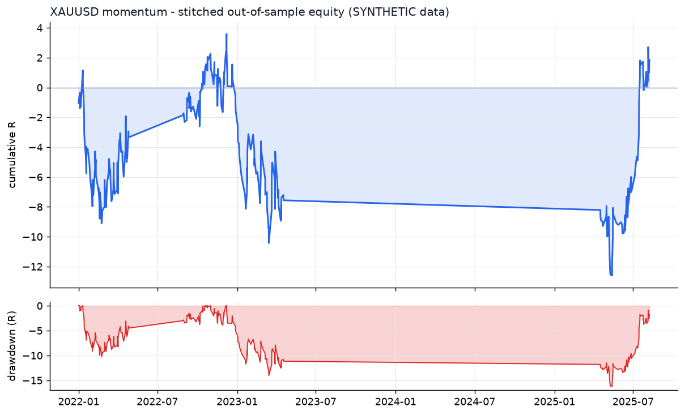
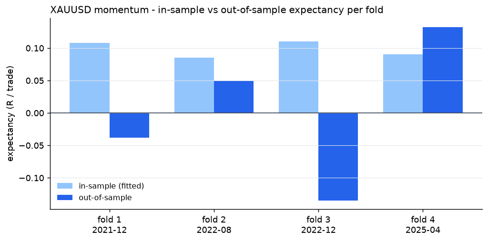
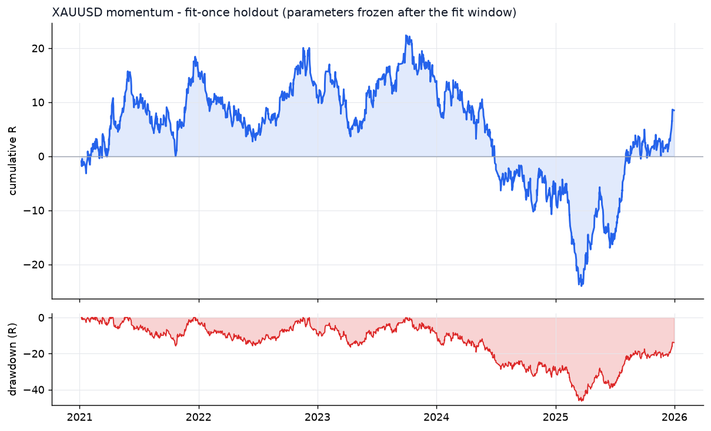

# XAUUSD - momentum - walk-forward result

- data: **SYNTHETIC (engine validation only)** - cache/XAUUSD_synth_7_2019-01-02_2025-12-31.parquet
- span: 2019-01-02 to 2025-12-31
- folds: 4 x (train 730d / test 120d), contiguous out-of-sample coverage 480 days
- configurations evaluated: 1,600

## Targets, measured on out-of-sample data only

| Target | Required | Achieved | Result |
|---|---|---|---|
| Trades >= 100 | 100 | 296 | **PASS** |
| Profit factor >= 1.20 | 1.20 | 1.02 | FAIL |
| Win rate >= 50% | 50.0 | 48.6 | FAIL |

## Metrics

| Metric | Walk-forward OOS | Fit-once holdout | Full sample (deployed params) |
|---|---|---|---|
| Trades | 296 | 1497 | 1437 |
| Win rate % | 48.6 | 48.4 | 53.8 |
| Profit factor | 1.02 | 1.02 | 1.23 |
| Expectancy (R) | 0.006 | 0.006 | 0.073 |
| Avg win (R) | 0.79 | 0.73 | 0.72 |
| Avg loss (R) | -0.74 | -0.67 | -0.68 |
| Payoff | 1.07 | 1.08 | 1.06 |
| Total R | 1.9 | 8.5 | 105.6 |
| Return % | 0.7 | 2.3 | 62.8 |
| Max DD % | 7.9 | 19.5 | 7.4 |
| Max DD (R) | 16.2 | 46.4 | 15.5 |
| Sharpe | 0.20 | 0.09 | 1.06 |
| Sortino | 0.50 | 0.15 | 1.84 |
| CAGR % | 0.8 | 0.4 | 5.8 |
| Calmar | 0.10 | 0.02 | 0.78 |
| Trades/day | 1.49 | 0.96 | 0.66 |
| Avg hold (min) | 137 | 148 | 155 |
| Max consec. losses | 11 | 9 | 13 |
| t-stat of mean R | 0.12 | 0.27 | 3.24 |
| Friction / gross % | 8.2 | 6.3 | 6.6 |

- walk-forward efficiency (OOS / IS expectancy): **0.06**
- bootstrap p-value for mean R > 0 (OOS): **0.4568**
- neighbourhood stability: 12 neighbours, median score 1.70, 100% positive

## Per-fold

```
walk-forward folds:
  1: train 2019-12-28..2021-12-27 IS  542tr +0.108R -> test 2021-12-27..2022-04-26 OOS   87tr -0.038R PF 0.91 WR 50.6%
  2: train 2020-08-24..2022-08-24 IS  446tr +0.085R -> test 2022-08-24..2022-12-22 OOS   78tr +0.050R PF 1.18 WR 50.0%
  3: train 2020-12-22..2022-12-22 IS  477tr +0.110R -> test 2022-12-22..2023-04-21 OOS   60tr -0.135R PF 0.75 WR 41.7%
  4: train 2023-04-11..2025-04-10 IS  411tr +0.090R -> test 2025-04-10..2025-08-08 OOS   71tr +0.133R PF 1.48 WR 50.7%
stitched OOS: trades   296 | WR  48.6% | PF  1.02 | exp +0.006R | payoff 1.07 | totR    +1.9 | ret    +0.7% | DD   7.9% | Sharpe  0.20 | t  0.12
walk-forward efficiency: 0.06
```

## Deployed parameters

```json
{
  "strategy": {
    "mode": "momentum",
    "tf_minutes": 15,
    "session": "london_ny",
    "atr_period": 14,
    "atr_rank_lookback": 288,
    "atr_rank_min": 0.1,
    "atr_rank_max": 0.99,
    "sl_atr": 3.0,
    "tp_r": 1.8,
    "min_sl_points": 750,
    "allow_long": true,
    "allow_short": true,
    "er_period": 24,
    "er_min": 0.45,
    "er_max": 1.0,
    "vwap_anchor_hour": 0,
    "band_k": 2.0,
    "rsi_period": 7,
    "rsi_lo": 28.0,
    "rsi_hi": 72.0,
    "adx_period": 14,
    "adx_max": 30.0,
    "confirm_mode": 2,
    "min_dev_atr": 0.0,
    "don_period": 24,
    "ema_fast": 12,
    "ema_slow": 48,
    "adx_min": 20.0,
    "expansion_mult": 1.15,
    "atr_avg_period": 48,
    "pb_slope_period": 30,
    "pb_rsi_lo": 40.0,
    "pb_rsi_hi": 60.0,
    "pb_depth_atr": 0.5,
    "pb_lookback": 6,
    "mom_period": 12,
    "mom_min_atr": 1.5,
    "mom_confirm": 0
  },
  "execution": {
    "point": 0.01,
    "value_per_point_per_lot": 1.0,
    "min_lot": 0.01,
    "lot_step": 0.01,
    "max_lot": 20.0,
    "commission_per_lot_rt": 7.0,
    "slippage_points_entry": 6.0,
    "slippage_points_stop": 14.0,
    "swap_long_points": -40.0,
    "swap_short_points": 10.0,
    "initial_equity": 10000.0,
    "risk_pct": 0.005,
    "max_spread_points": 90.0,
    "be_trigger_r": 1.0,
    "be_offset_r": 0.1,
    "partial_r": 0.0,
    "partial_frac": 0.5,
    "trail_start_r": 0.0,
    "trail_dist_r": 1.0,
    "max_bars": 180,
    "cooldown_bars": 20,
    "max_trades_per_day": 8,
    "daily_loss_limit_r": 1000000000.0,
    "force_exit_hour": 20,
    "force_exit_min": 45,
    "compound": true
  }
}
```

## Out-of-sample breakdown

**by hour**

|   hour |   trades |   win_rate |   total_r |   exp_r |
|-------:|---------:|-----------:|----------:|--------:|
|      6 |        6 |       66.7 |       1.1 |   0.186 |
|      7 |       31 |       32.3 |      -7.6 |  -0.246 |
|      8 |       15 |       53.3 |       3.5 |   0.235 |
|      9 |       20 |       40   |       1.8 |   0.088 |
|     10 |       16 |       31.2 |      -4.6 |  -0.288 |
|     11 |       13 |       46.2 |      -0.7 |  -0.052 |
|     12 |       38 |       47.4 |      -1.1 |  -0.028 |
|     13 |       36 |       61.1 |       5.6 |   0.156 |
|     14 |       28 |       60.7 |       1.8 |   0.064 |
|     15 |       34 |       55.9 |       2.9 |   0.086 |
|     16 |       26 |       50   |       1.6 |   0.06  |
|     17 |       23 |       43.5 |      -2.4 |  -0.106 |
|     18 |        5 |       60   |       0.4 |   0.08  |
|     19 |        5 |       20   |      -0.4 |  -0.087 |

**by direction**

| direction   |   trades |   win_rate |   total_r |   exp_r |
|:------------|---------:|-----------:|----------:|--------:|
| long        |      164 |         50 |      13.4 |   0.082 |
| short       |      132 |         47 |     -11.5 |  -0.087 |

**by exit**

| exit_reason   |   trades |   win_rate |   total_r |   exp_r |
|:--------------|---------:|-----------:|----------:|--------:|
| session_close |       10 |       40   |      -0   |  -0.004 |
| stop_loss     |      108 |       20.4 |     -84.1 |  -0.779 |
| take_profit   |       32 |      100   |      57.1 |   1.785 |
| time_stop     |      146 |       58.9 |      28.9 |   0.198 |

**by year**

|   year |   trades |   win_rate |   total_r |   exp_r |
|-------:|---------:|-----------:|----------:|--------:|
|   2021 |        1 |        0   |      -1   |  -1.045 |
|   2022 |      166 |       50   |      -0.5 |  -0.003 |
|   2023 |       58 |       43.1 |      -6   |  -0.104 |
|   2025 |       71 |       50.7 |       9.4 |   0.133 |







