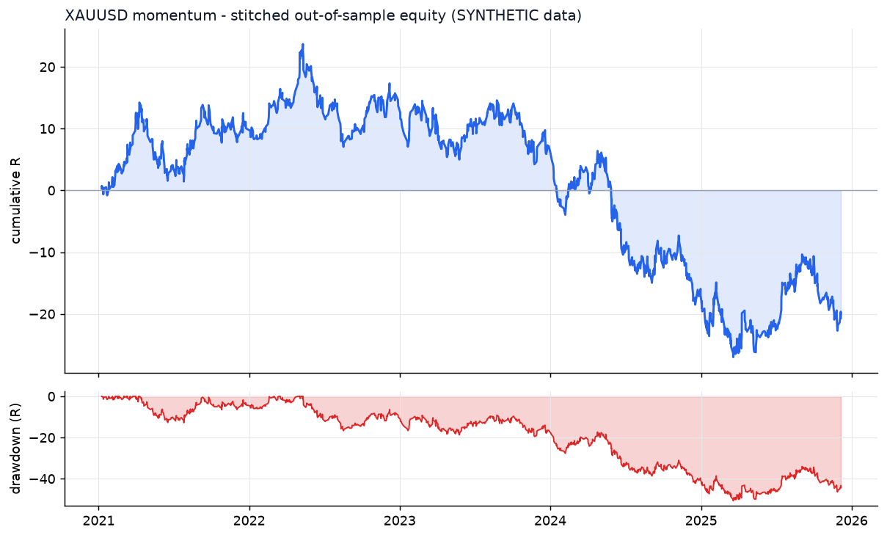
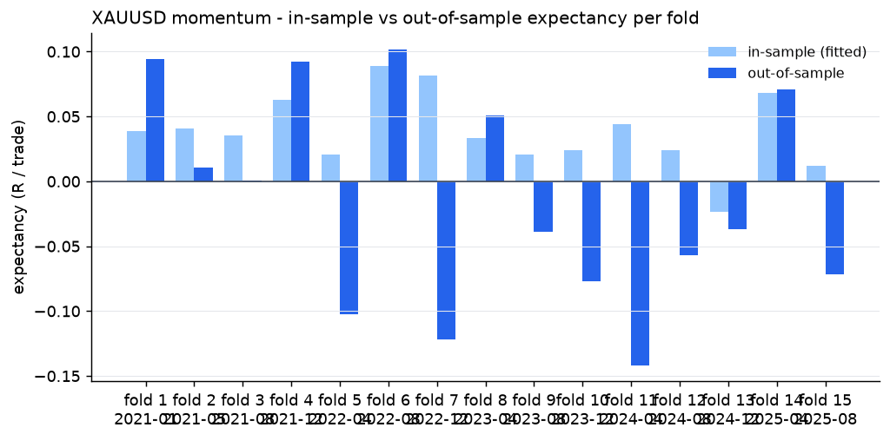
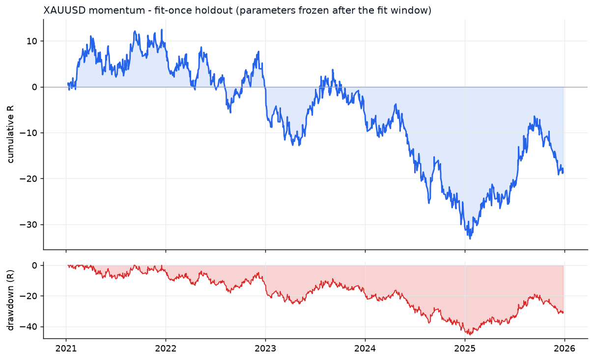

# XAUUSD - momentum - walk-forward result

- data: **SYNTHETIC (engine validation only)** - cache/XAUUSD_synth_7_2019-01-02_2025-12-31.parquet
- span: 2019-01-02 to 2025-12-31
- folds: 15 x (train 730d / test 120d), contiguous out-of-sample coverage 1800 days
- configurations evaluated: 6,000

## Targets, measured on out-of-sample data only

| Target | Required | Achieved | Result |
|---|---|---|---|
| Trades >= 100 | 100 | 1262 | **PASS** |
| Profit factor >= 1.20 | 1.20 | 0.96 | FAIL |
| Win rate >= 50% | 50.0 | 52.5 | **PASS** |

## Metrics

| Metric | Walk-forward OOS | Fit-once holdout | Full sample (deployed params) |
|---|---|---|---|
| Trades | 1262 | 1226 | 1917 |
| Win rate % | 52.5 | 52.7 | 55.5 |
| Profit factor | 0.96 | 0.96 | 1.04 |
| Expectancy (R) | -0.016 | -0.015 | 0.018 |
| Avg win (R) | 0.70 | 0.77 | 0.78 |
| Avg loss (R) | -0.81 | -0.89 | -0.92 |
| Payoff | 0.86 | 0.87 | 0.84 |
| Total R | -20.7 | -18.6 | 35.1 |
| Return % | -11.4 | -10.4 | 15.1 |
| Max DD % | 22.9 | 20.7 | 21.1 |
| Max DD (R) | 50.7 | 45.7 | 47.8 |
| Sharpe | -0.41 | -0.27 | 0.28 |
| Sortino | -0.85 | -0.45 | 0.50 |
| CAGR % | -3.5 | -1.8 | 1.6 |
| Calmar | -0.15 | -0.08 | 0.08 |
| Trades/day | 1.58 | 0.78 | 0.87 |
| Avg hold (min) | 107 | 102 | 96 |
| Max consec. losses | 10 | 11 | 8 |
| t-stat of mean R | -0.70 | -0.58 | 0.87 |
| Friction / gross % | 8.4 | 9.4 | 8.2 |

- walk-forward efficiency (OOS / IS expectancy): **-0.43**
- bootstrap p-value for mean R > 0 (OOS): **0.7682**
- neighbourhood stability: 13 neighbours, median score 0.15, 85% positive

## Per-fold

```
walk-forward folds:
  1: train 2019-01-02..2021-01-01 IS  483tr +0.039R -> test 2021-01-01..2021-05-01 OOS   94tr +0.094R PF 1.31 WR 58.5%
  2: train 2019-05-02..2021-05-01 IS  633tr +0.041R -> test 2021-05-01..2021-08-29 OOS  111tr +0.010R PF 1.04 WR 57.7%
  3: train 2019-08-30..2021-08-29 IS  553tr +0.035R -> test 2021-08-29..2021-12-27 OOS   79tr +0.001R PF 1.00 WR 54.4%
  4: train 2019-12-28..2021-12-27 IS  474tr +0.063R -> test 2021-12-27..2022-04-26 OOS   65tr +0.092R PF 1.37 WR 56.9%
  5: train 2020-04-26..2022-04-26 IS  513tr +0.021R -> test 2022-04-26..2022-08-24 OOS   82tr -0.102R PF 0.78 WR 48.8%
  6: train 2020-08-24..2022-08-24 IS  456tr +0.089R -> test 2022-08-24..2022-12-22 OOS   79tr +0.102R PF 1.41 WR 62.0%
  7: train 2020-12-22..2022-12-22 IS  520tr +0.081R -> test 2022-12-22..2023-04-21 OOS   66tr -0.122R PF 0.75 WR 47.0%
  8: train 2021-04-21..2023-04-21 IS  531tr +0.034R -> test 2023-04-21..2023-08-19 OOS   76tr +0.051R PF 1.16 WR 51.3%
  9: train 2021-08-19..2023-08-19 IS  487tr +0.021R -> test 2023-08-19..2023-12-17 OOS   73tr -0.039R PF 0.91 WR 53.4%
  10: train 2021-12-17..2023-12-17 IS  458tr +0.024R -> test 2023-12-17..2024-04-15 OOS   76tr -0.077R PF 0.83 WR 47.4%
  11: train 2022-04-16..2024-04-15 IS  519tr +0.044R -> test 2024-04-15..2024-08-13 OOS   97tr -0.142R PF 0.70 WR 45.4%
  12: train 2022-08-14..2024-08-13 IS  504tr +0.024R -> test 2024-08-13..2024-12-11 OOS   87tr -0.057R PF 0.86 WR 54.0%
  13: train 2022-12-12..2024-12-11 IS  530tr -0.024R -> test 2024-12-11..2025-04-10 OOS  111tr -0.037R PF 0.92 WR 49.5%
  14: train 2023-04-11..2025-04-10 IS  443tr +0.068R -> test 2025-04-10..2025-08-08 OOS   78tr +0.071R PF 1.23 WR 51.3%
  15: train 2023-08-09..2025-08-08 IS  522tr +0.012R -> test 2025-08-08..2025-12-06 OOS   88tr -0.072R PF 0.84 WR 50.0%
stitched OOS: trades  1262 | WR  52.5% | PF  0.96 | exp -0.016R | payoff 0.86 | totR   -20.7 | ret   -11.4% | DD  22.9% | Sharpe -0.41 | t -0.70
walk-forward efficiency: -0.43
```

## Deployed parameters

```json
{
  "strategy": {
    "mode": "momentum",
    "tf_minutes": 15,
    "session": "ny",
    "atr_period": 14,
    "atr_rank_lookback": 288,
    "atr_rank_min": 0.1,
    "atr_rank_max": 0.99,
    "sl_atr": 1.5,
    "tp_r": 2.2,
    "min_sl_points": 550,
    "allow_long": true,
    "allow_short": true,
    "er_period": 24,
    "er_min": 0.3,
    "er_max": 1.0,
    "vwap_anchor_hour": 0,
    "band_k": 2.0,
    "rsi_period": 7,
    "rsi_lo": 28.0,
    "rsi_hi": 72.0,
    "adx_period": 14,
    "adx_max": 30.0,
    "confirm_mode": 2,
    "min_dev_atr": 0.0,
    "don_period": 24,
    "ema_fast": 12,
    "ema_slow": 48,
    "adx_min": 20.0,
    "expansion_mult": 1.15,
    "atr_avg_period": 48,
    "pb_slope_period": 30,
    "pb_rsi_lo": 40.0,
    "pb_rsi_hi": 60.0,
    "pb_depth_atr": 0.5,
    "pb_lookback": 6,
    "mom_period": 12,
    "mom_min_atr": 1.5,
    "mom_confirm": 1
  },
  "execution": {
    "point": 0.01,
    "value_per_point_per_lot": 1.0,
    "min_lot": 0.01,
    "lot_step": 0.01,
    "max_lot": 20.0,
    "commission_per_lot_rt": 7.0,
    "slippage_points_entry": 6.0,
    "slippage_points_stop": 14.0,
    "swap_long_points": -40.0,
    "swap_short_points": 10.0,
    "initial_equity": 10000.0,
    "risk_pct": 0.005,
    "max_spread_points": 90.0,
    "be_trigger_r": 1.0,
    "be_offset_r": 0.1,
    "partial_r": 0.8,
    "partial_frac": 0.5,
    "trail_start_r": 1.2,
    "trail_dist_r": 1.0,
    "max_bars": 180,
    "cooldown_bars": 5,
    "max_trades_per_day": 8,
    "daily_loss_limit_r": 1000000000.0,
    "force_exit_hour": 20,
    "force_exit_min": 45,
    "compound": true
  }
}
```

## Out-of-sample breakdown

**by hour**

|   hour |   trades |   win_rate |   total_r |   exp_r |
|-------:|---------:|-----------:|----------:|--------:|
|      6 |       23 |       34.8 |      -5   |  -0.217 |
|      7 |       84 |       48.8 |      -6.4 |  -0.076 |
|      8 |       45 |       57.8 |       2.4 |   0.054 |
|      9 |       56 |       50   |      -0.4 |  -0.007 |
|     10 |       47 |       55.3 |       0.3 |   0.007 |
|     11 |       40 |       60   |       3.4 |   0.084 |
|     12 |      184 |       51.6 |     -13.5 |  -0.073 |
|     13 |      167 |       58.1 |       7.5 |   0.045 |
|     14 |      142 |       54.9 |      -0.5 |  -0.003 |
|     15 |      169 |       52.1 |      -2.7 |  -0.016 |
|     16 |      107 |       54.2 |       3.1 |   0.029 |
|     17 |      134 |       49.3 |      -1.9 |  -0.014 |
|     18 |       39 |       46.2 |      -2.6 |  -0.066 |
|     19 |       16 |       31.2 |      -3.9 |  -0.245 |
|     20 |        9 |       55.6 |      -0.5 |  -0.056 |

**by direction**

| direction   |   trades |   win_rate |   total_r |   exp_r |
|:------------|---------:|-----------:|----------:|--------:|
| long        |      649 |       50.8 |     -25.2 |  -0.039 |
| short       |      613 |       54.3 |       4.5 |   0.007 |

**by exit**

| exit_reason   |   trades |   win_rate |   total_r |   exp_r |
|:--------------|---------:|-----------:|----------:|--------:|
| breakeven     |      145 |      100   |      59.9 |   0.413 |
| session_close |       50 |       40   |      -6   |  -0.12  |
| stop_loss     |      422 |        7.8 |    -381.4 |  -0.904 |
| take_profit   |      183 |      100   |     205.9 |   1.125 |
| time_stop     |      462 |       61   |     101   |   0.219 |

**by year**

|   year |   trades |   win_rate |   total_r |   exp_r |
|-------:|---------:|-----------:|----------:|--------:|
|   2021 |      284 |       57   |      10   |   0.035 |
|   2022 |      228 |       55.3 |       3.6 |   0.016 |
|   2023 |      223 |       50.7 |      -6.5 |  -0.029 |
|   2024 |      261 |       49   |     -24.1 |  -0.092 |
|   2025 |      266 |       50.4 |      -3.7 |  -0.014 |







